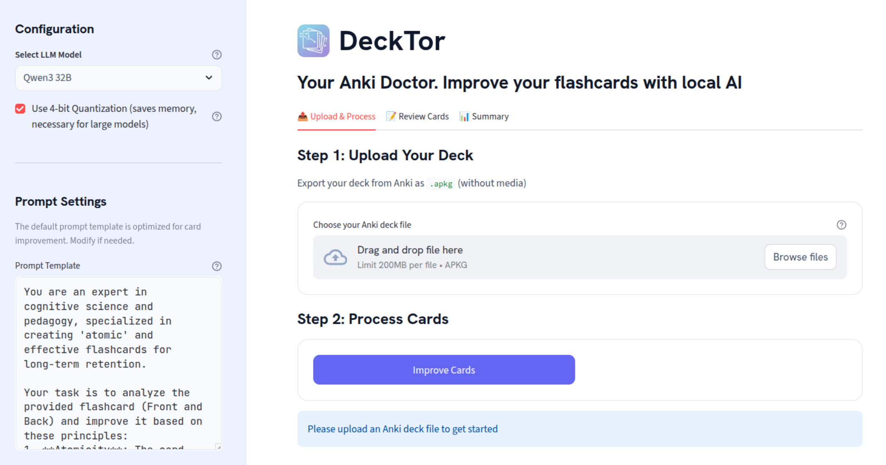
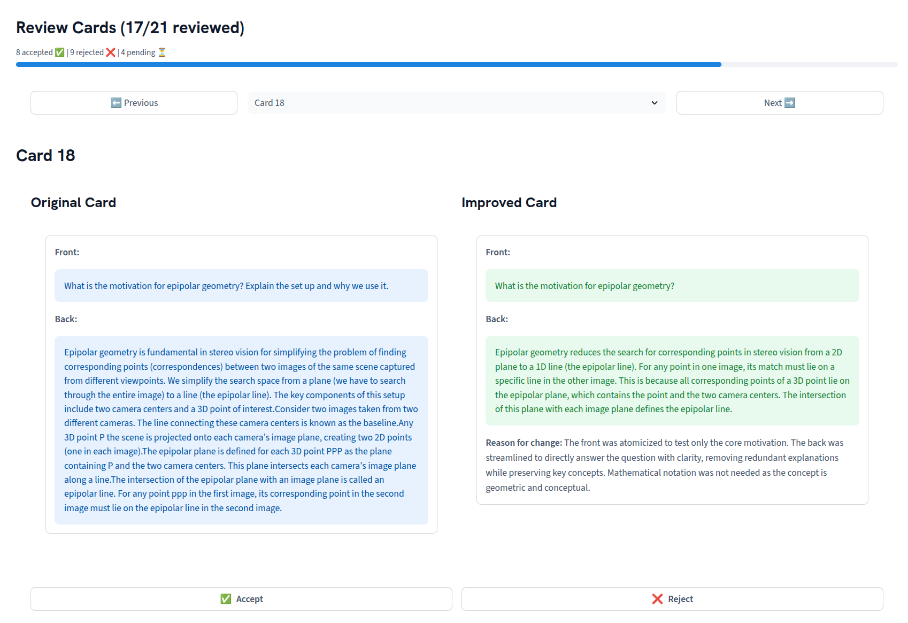
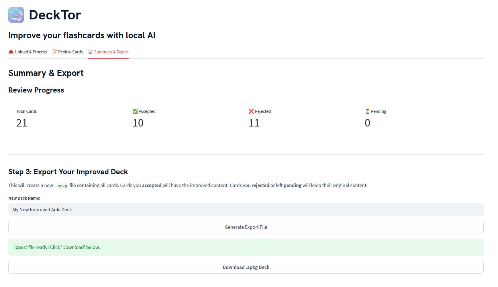

<div align="center">
  
</div>

# DeckTor
<div align="center">
    <a href="LICENSE"></a>
    <a href="https://www.python.org/"></a>
</div>


DeckTor uses **local** LLMs to help you find errors in your Anki deck and improve card quality. Models are fully local, so nothing is uploaded to the internet.

<div align="center">
  
</div>

## Features

- **100% Local & Private:** Models run entirely on your machine, so no data is ever uploaded to the internet.
* **Card Control:** You could upload a file with all your cards to a cloud-based LLM, and it will do an outstanding job at improving them. However, you won't have full control on what cards the model will effectively process (you'll see that the LLM answer will address some *but not all* cards). DeckTor explicitly processes every single card by default, giving you full control. 
* **Choose your LLM:** Leverages powerful quantized open-source models (like Qwen3) that you can choose.
* **Completely Free:** No API keys, no subscriptions, just your local hardware.
* **Simple Web Interface:** The app is very simple. Install it in two lines ([see below](#install)). Choose the model, drop your Anki deck, click on "Improve cards". It shouldn't be any more difficult than this :)
  
## Hardware Requirements
The LLMs *currently* supported by DeckTor (like `Qwen3 32B`) are too large to fit on most consumer GPUs in their native `float32` or `float16` precision. At the moment, we recommend an **NVIDIA GPU with ~16 GB of VRAM** to run the supported models. 

To make them accessible, we use two techniques:
* **4-bit Quantization:** The model weights are loaded and stored in VRAM using a 4-bit data type (`NF4` from `bitsandbytes`).
* **`bfloat16` Computation:** During the forward pass (inference), the 4-bit weights are de-quantized on the fly to `torch.bfloat16`.

## Install
1. Clone the repository and create the `conda` environment
```bash
git clone https://github.com/maurock/decktor.git
cd decktor
conda env create -f environment.yaml
conda activate decktor
```

2. Install the PyTorch version that works for you. For example:
```bash
pip install torch torchvision --index-url https://download.pytorch.org/whl/cu126
```

## Download Models
Before running the app, we recommend downloading the required LLMs.
You can see all available models in `src/models.py` under the `SUPPORTED_MODELS` dictionary.

* **(Recommended) To download one specific model (e.g. Qwen3 32B):**
    ```bash
    decktor download-models --models "Qwen3-4B (Thinking only)"
    ```
* **To download all supported models:**
    ```bash
    decktor download-models
    ```
The downloaded shards are cached for fast-reloading once you use the app.
If you skip this step, the models will be downloaded on-demand the first time you run the app.

## How to use
1. Export your Deck from the Anki desktop app. 
   - Select the `Anki package (.apkg) format`. 
   - Please uncheck "Include Media" when exporting.
  


2. Launch Decktor. In your activated `decktor` conda environment, run:
```
decktor run
```
This will launch the Streamlit web server. Open the "Local URL" (e.g., http://localhost:8501) in your browser.

3. Use the web interface to upload your `.apkg` file, select your desired model, and start processing your cards.

4. Once the cards are processed, go to the **Review** tab to accept or reject the changes.


4. Finally, export your Anki deck:


### What models should I use?
For reference, pleace check the benchmark below on a GPU NVIDIA RTX3090 (24GB VRAM):

| Model                             | Thinking toggle | Time per card |
| --------------------------------- | --------------- | ------------- |
| Qwen3-4B (Non-Thinking only)      | -               | 3s            |
| Qwen3-4B (Thinking only)          | -               | 50s           |
| Qwen3-32B (With/Without Thinking) | Non-active      | 7s            |
| Qwen3-32B (With/Without Thinking) | Active          | 70s           |

- If you have a consumer GPU with 16GB+ VRAM, the recommended model is **Qwen3-32B (With/Without Thinking)**, Thinking **non-active**, Quantization **active**. This should take <10s per Anki card.
- If your GPU has between 8GB and 16GB VRAM, the recommended model is **Qwen3-4B (Non-Thinking)**, Quantization **non-active**.
- If your GPU has less than 8GB VRAM, the recommended model is **Qwen3-4B (Non-Thinking)**, Quantization **active**.
- If you are GPU-rich, lucky you! Choose the model you prefer with Thinking active and Quantization non-active.

## Roadmap
- [ ] Add inference parameters to the sidebar for power users (`temperature`, `top_p`, `max_new_tokens`)
- [ ] Add batch processing
- [ ] Add export options (.apkg, .json, .txt)
- [ ] Add support for more models (e.g. Gemma3, Qwen3-14B)
- [ ] Add support for multiple types of Anki cards
- [ ] Add API key support.


## LICENSE
DeckTor is released under the MIT License. See the LICENSE file for more details.


