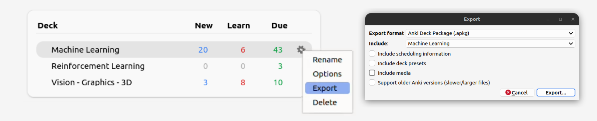

# DeckTor: Your Anki Doctor
DeckTor uses **local** LLMs to help you find errors in your Anki deck and improve card quality. Models are fully local, so nothing is uploaded on the internet.
  
## Install
1. Clone the repository and create the `conda` environment
```bash
git clone https://github.com/maurock/decktor.git
cd decktor
conda env create -f environment.yaml
conda activate decktor
```

2. Install PyTorch
Install the torch version that works for you. For example:
```bash
pip install torch torchvision --index-url https://download.pytorch.org/whl/cu126
```

## Download models
Before running the app, we recommend downloading the required LLMs.
You can see all available models in `src/models.py` under the `SUPPORTED_MODELS` dictionary.

* **(Recommended) To download one specific model (e.g. Qwen3 32B):**
    ```bash
    decktor download-models --models "Qwen3 32B"
    ```
* **To download all supported models:**
    ```bash
    decktor download-models
    ```
The downloaded shards are cached for fast-reloading once you use the app.
If you skip this step, the models will be downloaded on-demand the first time you run the app.

## Run
Export your Deck from Anki. **Important**: please uncheck "Include Media" when exporting.


Then, simply run:
```
decktor run
```
This will launch a Streamlit web interface. Open your browser and navigate to Local URL that Streamlit outputs. Use the extracted `.apkg`.


## Additional notes
The LLMs *currently* supported by DeckTor (like `Qwen3 32B`) are too large to fit on most consumer GPUs in their native `float32` or `float16` precision. To make them accessible, we use two techniques:
-  **4-bit Quantization:** The model weights are loaded and stored in VRAM using a 4-bit data type (`NF4` from `bitsandbytes`). 
-  **`bfloat16` Computation:** During the forward pass (inference), the 4-bit weights are de-quantized on the fly to `torch.bfloat16`.

This combination provides a good balance of VRAM efficiency and numerical stability, and allows the models to run within **approximately 16 GB of VRAM**.


## Roadmap
- [ ] Add support for more models (e.g. Gemma3, Qwen3-14B)
- [ ] Add support for multiple types of Anki cards


## LICENSE
DeckTor is released under the MIT License. See the LICENSE file for more details.


